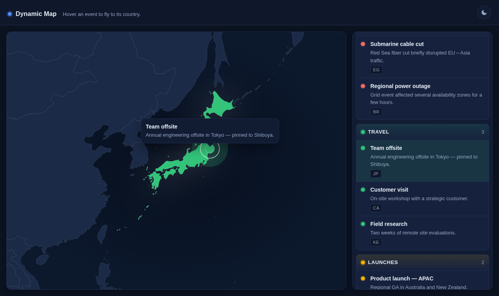

# Interactive Dynamic Map

A small full-stack demo: a Go backend serves a YAML-defined list of events, and
a vanilla-JS/HTML/CSS frontend embeds a world SVG that highlights, zooms, and
tooltips the country an event belongs to when you hover or tap the event.

**Author:** Uriel Márquez ([@umarquez](https://github.com/umarquez))



## Features

- World map with **ISO 3166-1 alpha-2** country codes baked into the SVG paths.
- **Per-event pin placement**: country centroid by default, or precise
  `lat`/`lng` override per event.
- **Overview pins** — small colored dots for every event are shown on the
  default world view; they fade away on focus so the active country and pin
  take the stage.
- **Smooth viewBox zoom** to the focused country with a `requestAnimationFrame`
  tween (`prefers-reduced-motion` respected).
- **Tooltip** that stays fully inside the map — auto-clamped, with the arrow
  re-tracking the pin even after the card is shifted to fit.
- **Touch + mouse + keyboard**: mouse hover, tap-to-toggle on touch, Enter/Space
  on keyboard. Click is gated by `pointerdown` type so a desktop click while
  hovering doesn't accidentally deactivate.
- **Light / dark theme** with a header toggle. Initial value resolves from
  `localStorage` → `prefers-color-scheme` via an inline script in `<head>` so
  there's no flash of the wrong palette.
- **Responsive**: a stacked layout (map above, list below) under 900px wide.
- **Zero frontend build step** — native ES modules, no bundler, no framework.
- **Docker** image at ~20 MB, multi-stage build, runs as non-root with
  `tini` as PID 1 and a wget-based healthcheck.

## Quick start

### With Docker (recommended for deployment)

```bash
docker compose up -d
open http://localhost:8080
```

Edit `locations.yaml` on the host, then `docker compose restart` to apply
(the server caches groups at startup).

### Local Go toolchain

```bash
go run ./cmd/app                # serves on :8080, binds to all interfaces
go run ./cmd/app -addr :9000    # custom port
go run ./cmd/app -data ./other.yaml
go test ./...
```

The server reads `index.html`, `assets/`, and `locations.yaml` from the
`-root` directory (default: the working directory).

## `locations.yaml` schema

```yaml
groups:
  - id: conferences           # unique slug
    name: Conferences          # display name
    color: "#4f8cff"            # used for the list, the pins, and the country highlight
    events:
      - title: KubeCon Europe
        description: Cloud-native community conference.
        country: DE             # ISO 3166-1 alpha-2 — matches a <path id> in world.svg
      - title: AWS re:Invent
        description: Pinned to Las Vegas via lat/lng.
        country: US
        lat: 36.1699            # optional — overrides the country centroid
        lng: -115.1398          # optional — pairs with lat
```

The country code is normalized to uppercase at parse time. `lat`/`lng` are
optional; events without them get a pin at the country path's bounding-box
center.

## Architecture

### Backend — `cmd/app` + `internal/`

Layered Go stdlib `net/http` server (no router framework):

```
cmd/app/main.go            wires Repository → Service → Handler → Server
internal/groups/
  model.go                 Group / Event types (Lat & Lng are *float64 so omission round-trips)
  repository.go            Repository interface; YAMLRepository reads locations.yaml
  service.go               caches the parsed groups at startup (Preload)
internal/httpapi/
  handler.go               GroupsHandler depends on a narrow GroupsReader interface
  server.go                routes /api/v1/groups, /, /assets/* with directory listing blocked
```

`go.mod` only declares one non-stdlib dependency: `gopkg.in/yaml.v3`.

### Frontend — `assets/` + `index.html`

Native ES modules; each owns one concern:

```
assets/js/
  main.js          composition root — wires controllers
  api.js           single fetch('/api/v1/groups')
  eventsList.js    renders the sidebar from <template>s; emits hover/tap/keyboard
  map.js           MapController — owns the SVG and viewBox state machine
  projection.js    geo → SVG pixel projection (empirically calibrated; see "Projection")
  tooltip.js       Tooltip — measures, clamps, flips, points the arrow at the pin
  theme.js         light/dark toggle + localStorage persistence
assets/css/
  reset.css, layout.css, events-list.css, map.css, tooltip.css
```

Controllers meet only in `main.js`. The map controller knows nothing about
events; the list module knows nothing about SVG. Swapping the renderer or the
list view would only touch one file.

### Projection — why it's empirical

`assets/world.svg` ships with a `mapsvg:geoViewBox` attribute, but the rendered
paths don't follow it as a clean equirectangular mapping. Coefficients in
`assets/js/projection.js` are fit against measured `getBBox()` centroids of
DE / EG / AU:

```
x = 2.836 * lng + 474.5
y = -3.6  * lat + 478.6
```

Good enough for "pin lands inside the right country", not city-block precision.
If you swap the SVG asset, recalibrate by reading the bboxes of three
well-known countries and re-solving.

## API

| Method | Path                | Returns                                  |
| ------ | ------------------- | ---------------------------------------- |
| GET    | `/`                 | `index.html`                             |
| GET    | `/assets/*`         | static files; directory listings blocked |
| GET    | `/api/v1/groups`    | `{ "groups": [...] }`                    |
| GET    | `/locations.yaml`   | `404` (source data is not exposed)       |

Other methods on `/api/v1/groups` return `405`.

## Tests

Stdlib `testing` only. Run with:

```bash
go test ./...
go vet ./...
```

Covers YAML parsing (happy path + malformed + missing file) and the handler
(`200` happy path, `nil → []` shape, `405`, `500` on reader error).

## Tech stack

- Go 1.25 (`net/http`, `encoding/json`, `gopkg.in/yaml.v3`)
- Vanilla JS (ES modules), HTML, CSS — no framework, no build step
- Alpine + tini for the container, multi-stage Docker build

## License

[MIT](./LICENSE).
